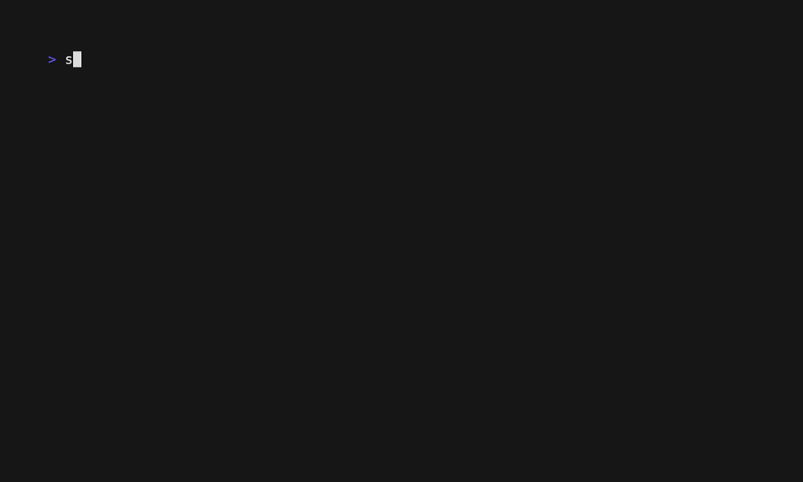

<div class="draft-watermark"></div>
# Configuration

Windsor CLI uses configuration files to manage settings. The configuration files are typically located in the following paths:

- **CLI Configuration**: `~/.config/windsor/config.yaml`
- **Project Configuration**: `./windsor.yaml` or `./windsor.yml`

You can customize these configurations to suit your needs.

### Example Configuration

Here is an example of a CLI configuration file:

```yaml
context: local
contexts:
  local:
    aws:
      aws_endpoint_url: ""
      aws_profile: local
      localstack:
        services:
        - iam
        - sts
        - kms
        - s3
        - dynamodb
      mwaa_endpoint: http://mwaa.local.aws.test:4566
      s3_hostname: http://s3.local.aws.test:4566
    cluster:
      controlplanes:
        count: 1
        cpu: 2
        memory: 2
      driver: talos
      workers:
        count: 1
        cpu: 4
        memory: 4
    docker:
      enabled: true
      registries:
      - local: ""
        name: registry.test
        remote: ""
      - local: https://docker.io
        name: registry-1.docker.test
        remote: https://registry-1.docker.io
      - local: ""
        name: registry.k8s.test
        remote: https://registry.k8s.io
      - local: ""
        name: gcr.test
        remote: https://gcr.io
      - local: ""
        name: ghcr.test
        remote: https://ghcr.io
      - local: ""
        name: quay.test
        remote: https://quay.io
    git:
      livereload:
        image: ghcr.io/windsorcli/git-livereload-server:v0.2.1
        password: local
        rsync_exclude: .docker-cache,.terraform,data,.venv
        rsync_protect: flux-system
        username: local
        verify_ssl: false
        webhook_url: http://flux-webhook.private.test
    terraform:
      backend: local
    vm:
      arch: aarch64
      cpu: 4
      disk: 60
      driver: colima
      memory: 8
```

# Environment Variables

## Kubernetes and Talos Environment Variables
```bash
export TALOSCONFIG="*****/contexts/local/.talos/config"
export KUBECONFIG="*****/contexts/local/.kube/config"
export KUBE_CONFIG_PATH="*****/contexts/local/.kube/config"
```

## AWS Environment Variables
```bash
export AWS_CONFIG_FILE="*****/contexts/local/.aws/config"
export AWS_ENDPOINT_URL="http://aws.test:4566"
export AWS_PROFILE="local"
```

## Terraform Environment Variables
```bash
export TF_CLI_ARGS_apply="*****/contexts/local/.terraform/cluster/talos/terraform.tfplan"
export TF_CLI_ARGS_destroy="-var-file=*****/contexts/local/terraform/cluster/talos.tfvars \
  -var-file=*****/contexts/local/terraform/cluster/talos_generated.tfvars.json"
export TF_CLI_ARGS_import="-var-file=*****/contexts/local/terraform/cluster/talos.tfvars \
  -var-file=*****/contexts/local/terraform/cluster/talos_generated.tfvars.json"
export TF_CLI_ARGS_init="-backend=true -backend-config=path=*****/contexts/local/.tfstate/cluster/talos/terraform.tfstate"
export TF_CLI_ARGS_plan="-out=*****/contexts/local/.terraform/cluster/talos/terraform.tfplan \
  -var-file=*****/contexts/local/terraform/cluster/talos.tfvars \
  -var-file=*****/contexts/local/terraform/cluster/talos_generated.tfvars.json"
export TF_DATA_DIR="*****/contexts/local/.terraform/cluster/talos"
export TF_VAR_context_path="*****/contexts/local"
```

# Secrets

## Secrets File : 

The sops encrypted file "secrets.enc.yaml" contains env-var-nam/value pairs of secrets.  Windsor generates environment variables based on the contents of this file.  

The secrets yaml file is located in the context's config folder.

**contexts/< context-name >/secrets.enc.yaml**



The windsor env command applies all secrets listed in the context's secrets file.

The secrets file for each context is located here,

$PROJECT_ROOT/contexts/< context-name >/secrets.enc.yaml

The secrets file contains a key/value pairs of secrets that are applied to the shell's environment.


## Try it out

```bash
sops edit contexts/local/secrets.enc.yaml
```

Add these lines

```bash
api_key: plaintext-value
db_password: plaintext-password
```

Save the file.  Confirm environment variables are set.

```bash
env | grep api_key
api_key=plaintext-value

env | grep db_password
db_password=plaintext-password
```

<div>
{{ previous_footer('Home', '../../index.html') }}
</div>

<script>
  document.getElementById('previousButton').addEventListener('click', function() {
    window.location.href = '../../index.html'; 
  });

</script>

