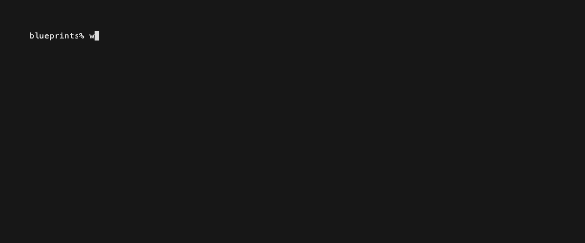
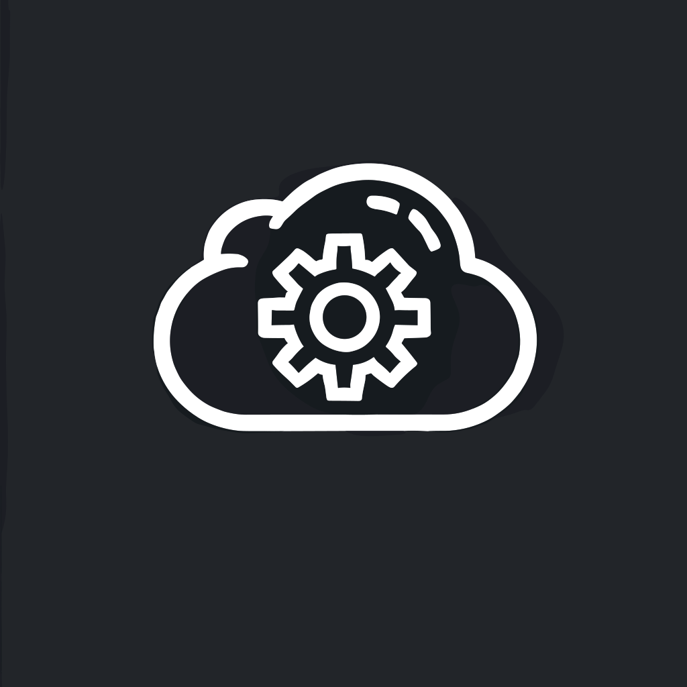

<!-- Add this to reveal the draft watermark -->
<!-- 

 -->

# [WindsorCLI](https://windsor-hotel.github.io/windsorcli/)
The Windsor Command Line Interface (CLI) is a powerful tool designed to streamline your workflow and enhance productivity. With a small suite of intuitive commands, the Windsor CLI allows you to efficiently manage contexts for other tools in your development environment.

## 

<!-- 

  
  
  

 -->

## [Purpose](#purpose)

The Windsor CLI is designed to simplify and enhance the development workflow for developers working on various projects. Its primary purpose is to provide a unified command-line interface that streamlines project setup, configuration management, and integration with other tools. 

By offering a consistent and efficient way to manage "contexts", the Windsor CLI aims to reduce the time and effort required for repetitive tasks, allowing developers to focus more on coding and less on setup and configuration.

Key objectives of the Windsor CLI include:

- **Efficiency**: Start with a pre-configured, working, and fully functional environment.
- **Consistency**: Ensure a standardized approach and consistent tool usage across different environments and teams.
- **Flexibility**: Support a wide range of configurations and integrations to accommodate diverse project needs.
- **Scalability**: Scale the environment and the production workload.
- **Configuration Management**: Easily manage and switch between different project configurations.
- **Shell Integration**: Seamlessly integrate with your shell environment for enhanced productivity.
- **Cross-Platform Compatibility**: Provide a seamless experience on Windows, macOS, and Linux systems.
- **Security**: Fully compliant and automated security updates.
- **Visibility**: Provide dashboards to ensure informative decisions.

## [Contributing](#contributing)
We welcome contributions to Windsor CLI! If you would like to contribute, please follow these steps:

1. Fork the repository.
2. Create a new branch for your feature or bugfix.
3. Make your changes and commit them with a descriptive message.
4. Push your changes to your fork.
5. Create a pull request to the main repository.

Please ensure that your code adheres to our coding standards and includes appropriate tests.

## [License](#license)

Windsor CLI is licensed under the Mozilla Public License Version 2.0. See the [LICENSE](LICENSE) file for more details.

## [Contact Information](#contact-information)

Thank you for using Windsor CLI! If you have any questions or need further assistance, please feel free to open an issue on our GitHub repository.

<!-- Add buttons to load new files -->
<button id="quickStartButton">Quick Start</button>
<button id="demoButton">Local Cluster Demo</button>

{{ next_footer('Installation', 'install/index.html') }}

