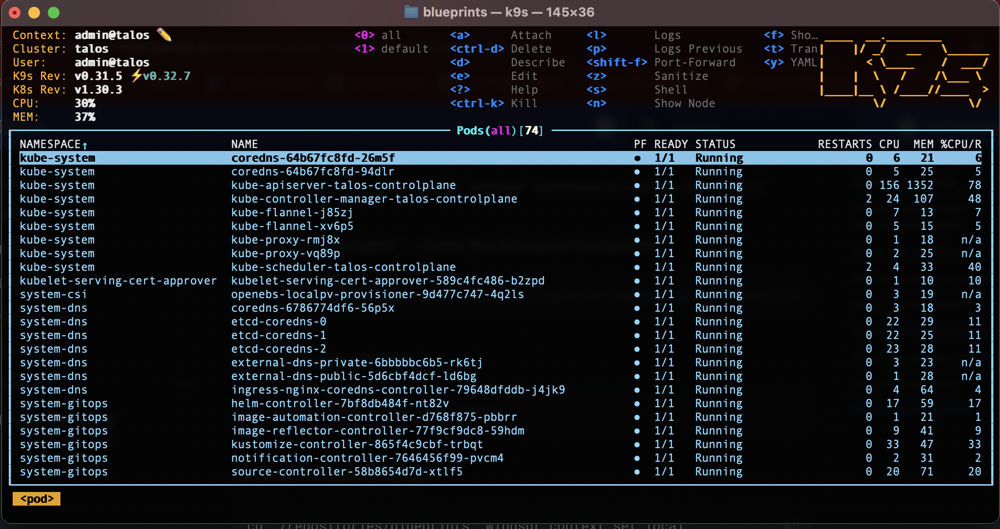
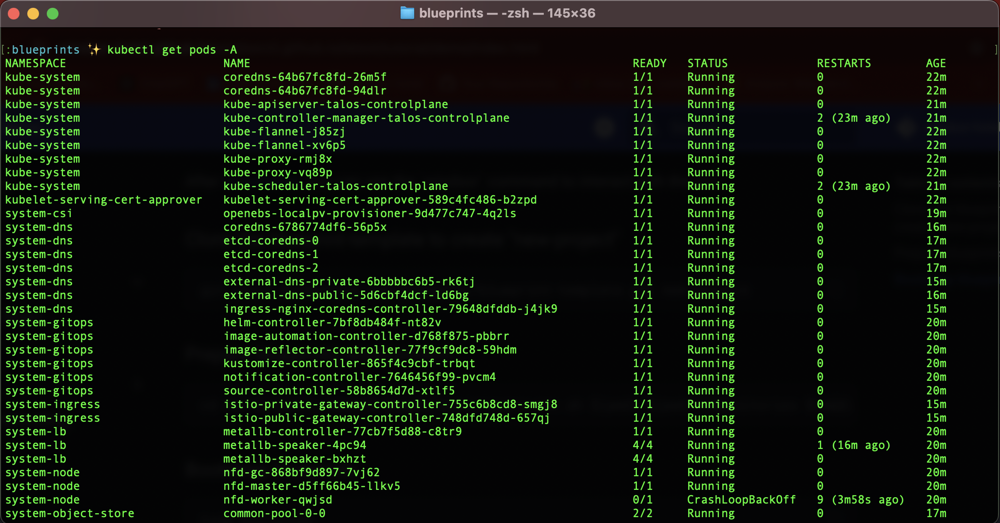

# Local Cluster Demo
After [installation](../install/install.md), you can use the \`windsor\` command to interact with the CLI. 

### Clone the blueprint-template to create "new-project"

```sh
git clone git@github.com:tvangundy/blueprint-template.git new-project
```

### Prepare blueprints environment

```sh
cd new-project; source $(pwd)/bin/prepare-env.sh $(pwd) $(pwd)/repositories $(pwd)/repositories/blueprints local
```

### Bootstrap blueprints
```sh
task bootstrap
```

### K9s

Run k9s command to see the pods 

```sh
k9s
```



### View pods with kubectl command
```bash
kubectl get pods -A
```



<div>
{{ previous_footer('Quick Start', '../../tutorial/quick-start/index.html') }}
</div>

<script>
  document.getElementById('previousButton').addEventListener('click', function() {
    window.location.href = '../../tutorial/quick-start/index.html'; 
  });
</script>
