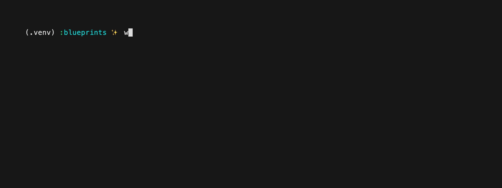
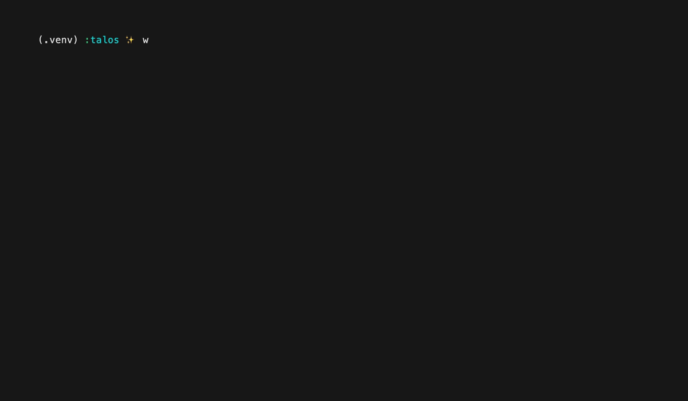

<div class="draft-watermark"></div>

# Quick Start
After [installation](../install/install.md), you can use the \`windsor\` command to interact with the CLI. Here are some common commands:

### Check windsor version

```sh
windsor version
```

### Set the context to local

```sh
windsor context set local
```
This command initializes the application by setting up necessary configurations and environment.

### Get the current context

```sh
windsor context get
```
This command gets the current context.

### Get the environment variables for the local context

```sh
windsor env
```

This command displays the environment variables set by the current context.



### Terraform Environment Variables

Run env command in a terraform folder to see the environment variables that are set for terraform.




<div>
{{ footer('Installation', '../../install/install/index.html', 'Local Cluster Demo', '../../tutorial/local-cluster-demo/index.html') }}
</div>

<script>
  document.getElementById('previousButton').addEventListener('click', function() {
    window.location.href = '../../install/install/index.html'; 
  });

  document.getElementById('nextButton').addEventListener('click', function() {
    window.location.href = '../../tutorial/local-cluster-demo/index.html'; 
  });
</script>


